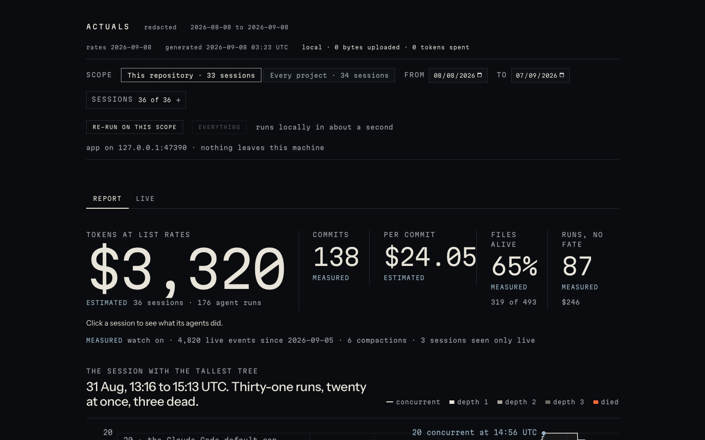
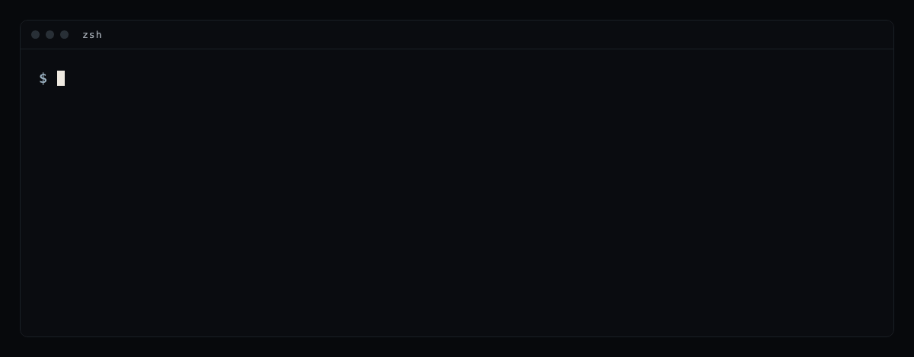

# Actuals





See what your coding agents actually shipped. Reads your own Claude Code sessions and your
git history, on your machine.

```
npx actuals
```

Reads your Claude Code transcripts and this repository's git history, locally, and shows what
the agents actually left behind: what was kept, what got thrown away, what quietly died, and
what it cost. Tokens at list rates, commits made inside
sessions, cost per commit, which files agents wrote are still on disk, which agent runs
died or produced nothing you can find, how tall your agent trees got, and which model gave
you kept work per dollar. Then it derives fixes from those numbers and applies them with one
confirm.

Nothing leaves your machine. No account, no upload, no model call. Tokens spent making the
report: 0.

## What you get

- The report, opened as a local app on `127.0.0.1` (loopback only): every number marked
  `measured`, `estimated`, `assumed`, or `your label`, and the rule that produced it.
  A picker re-runs on a date range or a set of sessions; click a session for its files
  with their fate, commits, agent runs drawn to time, the `/insights` claim, and your
  label; the tallest-tree instrument draws any session; each fix shows its real diff and
  applies on one click, with undo beside it. The same report is written as a static file
  at `~/.actuals/<repo>/runs/<run>/report.html`; `actuals export` copies it out.
- Fixes derived from your own history: cap the agent tree at what your machine survived,
  make every agent report land on disk, run a blind paired model test.
- `actuals share` for an aggregates-only card. `actuals weekly` for the Monday view.
- `actuals label` for the one column nobody else can fill: whether it mattered.

## Commands

```
actuals run [--since 30d] [--all-projects] [--redact] [--generous] [--no-open]
actuals app [--no-open] [--port N]   serve the latest report on 127.0.0.1 without re-running
actuals export [--out <file>]        write the static report file; --ledger for the ledger as NDJSON
actuals watch [--no-hud] [--yes]     always-on status line: a HUD plus hooks writing a local live ledger
actuals hud --serve [--no-open]      open the live window (pin it beside the editor or in VS Code Simple Browser)
actuals unwatch                      remove them, byte-identical
actuals fix [--dry-run] [--yes]      show derived fixes, apply on confirm
actuals undo <fix-id>                restore byte-identical
actuals share                        the aggregates-only card as share.svg and share.txt
actuals share --hosted [--yes]       upload the redacted report for a share link; shows what leaves first (works once the site update ships)
actuals login                        connect this computer to your account, no key to copy (works once the site update ships)
actuals logout                       disconnect this computer, remove the stored key (works once the site update ships)
actuals licence <key>                store a licence key by hand (headless or CI)
actuals weekly · actuals label <id> kept|retired|dead|open "<note>"
actuals doctor                       what it can see and what it cannot
```

`actuals watch` installs, with one confirm and a shown diff, a Claude Code statusline
command and a few hooks. The statusline shows cost at list rates, context, agents against
the cap, deaths and compactions; every event appends one line to a live ledger under
`~/.actuals/<repo>/live/`. The report merges it with the transcripts, marks rows that exist
only there, and says how far compaction and transcript cleanup stopped being blind spots.
Where the statusline recorded Claude Code's own cost for a session, the report uses that
figure for the session and marks it measured; every other session is priced at list rates,
and the headline says how many of each.
No daemon. Nothing leaves the machine.

The one thing that can ever leave the machine is a hosted run, and only when you ask:
`actuals share --hosted` (or "share as a page" in the app) re-runs the report redacted,
lists exactly what would be sent (no prompt, path, file name, commit message, code, title
or goal), waits for one confirm, and posts it with your licence key. Five are free for the
life of the account.

The app binds `127.0.0.1` on a random port and answers only its own host, with a
per-launch token on every write; it stops a few minutes after the page closes. Nothing
leaves the machine: an automated check proves that no connection other than to your own
machine is ever opened.

## How it counts

Claude Code writes one transcript line per content block and repeats the request's usage
on each line; Actuals counts usage once per request. Counters that sum every line (the
`/insights` session-meta files do) report roughly four times the output tokens. A commit is "made inside a session"
only when its author time is inside the session window, the session ran in this
repository, and the session issued `git commit` within five minutes. Unknown fate is never
counted as kept. Accuracy checks in `ACCURACY.md`.

First pass reads Claude Code. Codex is next.

## Licence

Source available under the Functional Source License, FSL-1.1-ALv2 (see `LICENSE.md`):
read it, run it, change it, and use it for anything except making a competing product or
service. Each version converts to Apache-2.0 two years after its release. The 0.1.0 already
on npm was published under Apache-2.0 and stays that way.
